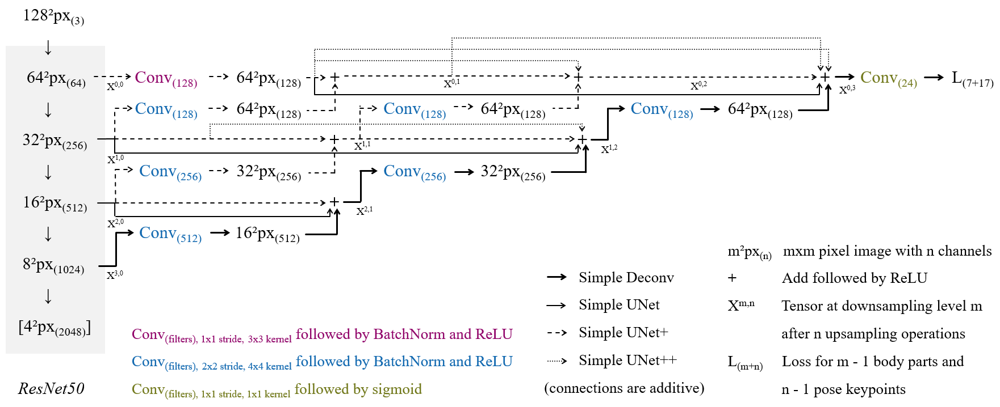

# Body part parsing and pose estimation of single human figures with simplified UNet++ versions

This is code for the article [Instance Segmentation, Body Part Parsing, and Pose Estimation of Human Figures in Pictorial Maps](https://doi.org/10.1080/23729333.2021.1949087). Visit the [project website](http://narrat3d.ethz.ch/segmentation-of-human-figures-in-pictorial-maps/) for more information.


## Installation

* Requires [Python 3.7.x](https://www.python.org/downloads/) or higher
* Requires [CUDA Toolkit 10.0](https://developer.nvidia.com/cuda-downloads) and corresponding [cuDNN](https://developer.nvidia.com/rdp/cudnn-download)
* Download [this project](https://gitlab.ethz.ch/narrat3d/pictorial-maps-simple-unets/-/archive/master/pictorial-maps-mask-rcnn-master.zip)
* pip install -r requirements.txt

## Training
* Download the [training data](https://ikgftp.ethz.ch/?u=K8bH&p=3RwE&path=/human_figures_training_data.zip) and [test data](https://ikgftp.ethz.ch/?u=VDYk&p=Bm6D&path=/human_figures_test_data.zip), store them in the same folder and set DATASET_FOLDER to its location in config.py
* Set LOG_FOLDER in config.py where intermediate snapshots shall be stored
* Optionally adjust properties like datasets (e.g. separated), architectures (e.g. simple_unet), and number of runs (e.g. 1st)
* Run train_and_eval_wrapper.py
* If you enable the DEBUG variable in config.py, the CNN is trained only on the first 10 images, which are also used for validation. By this, it can be tested if a network is able to learn. 

## Evaluation
* Once a training run finishes, the best model of all epochs will be automatically evaluated
* Optionally calculate custom error metrics of a single run in error_metrics.py
* Optionally calculate the average precision of a single run in coco_metrics.py 
* Scores of multiple runs can be aggregated and the highest score can be determined in coco_metrics_summary.py

## Inference
* Download the [pre-trained model](https://ikgftp.ethz.ch/?u=cndC&p=tWwd&path=/human_figures_model.zip) and set the INFERENCE_MODEL_FOLDER in config.py to its location
* Run inference.py

## Tested architectures


## Citation
Please cite the following article when using this code:
```
@article{schnuerer2022instance,
  author = {Raimund Schnürer, A. Cengiz Öztireli, Magnus Heitzler, René Sieber and Lorenz Hurni},
  title = {Instance Segmentation, Body Part Parsing, and Pose Estimation of Human Figures in Pictorial Maps},
  journal = {International Journal of Cartography},
  volume = {8},
  number = {3},
  pages = {291-307},
  year = {2022},
  doi = {10.1080/23729333.2021.1949087}
}
```

© 2020-2021 ETH Zurich, Raimund Schnürer
